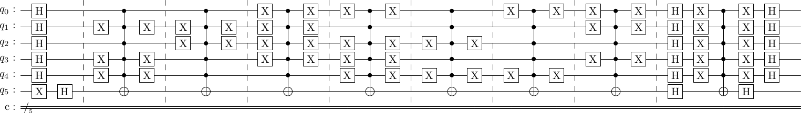
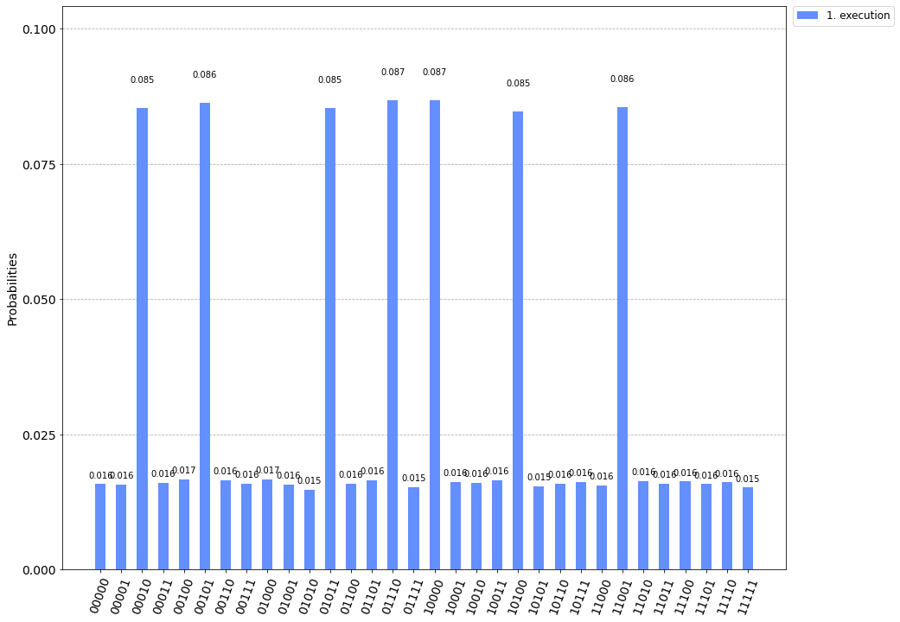
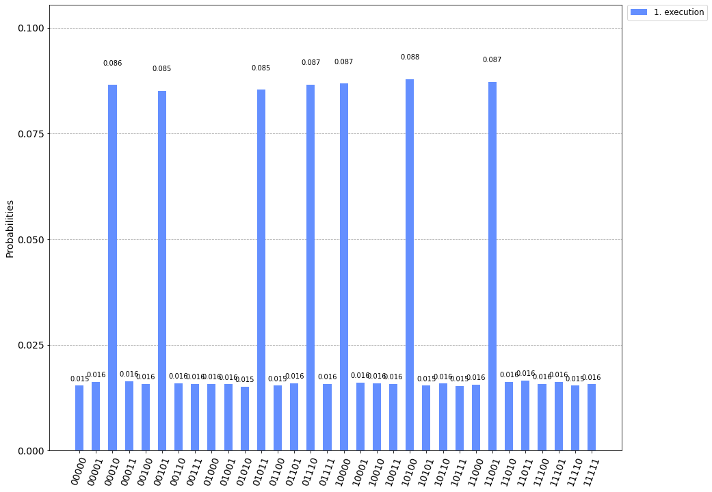
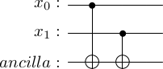
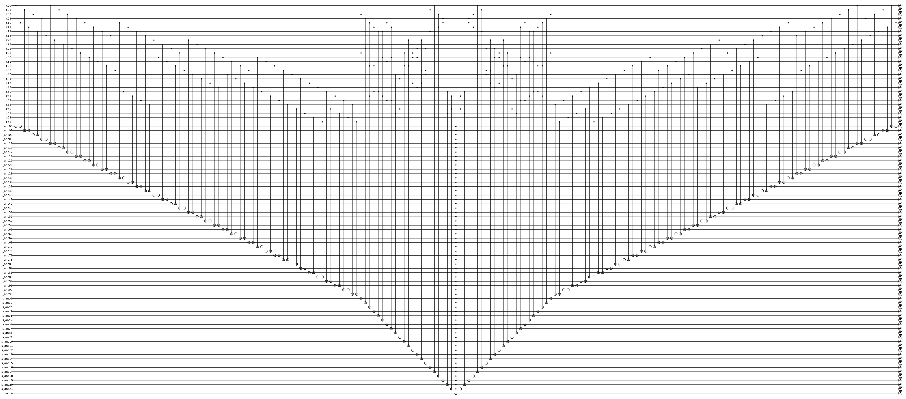

## Introduction

[Classiq](https://www.classiq.io/) organized an interesting quantum coding competition in May and June 2022. The competition consisted of four problems: [Kakuro](https://www.classiq.io/competition/kakuro), [decomposing multi-control CNOT gate](https://www.classiq.io/competition/toffoli), [Hamiltonian simulation](https://www.classiq.io/competition/hamiltonian) and [log-normal state preparation](https://www.classiq.io/competition/state-preparation).

This blog post discusses my studies on the Kakuro problem, which should be solved with Grover's algorithm. This problem has been somewhat confusing. If we read the problem definition very carefully, it does not describe what kind of Grover algorithm application it should be. The question is if we are allowed to encode the constraints in Grover's oracle, which is, in my opinion, a lot easier task than writing an oracle that genuinely solves the puzzle.

I developed three different solutions to the challenge. Again, these solutions did not really meet the judging criteria and were not among the winning solutions. But instead, they study the problem from different angles. 

First, I represent the solution that encodes the variables and values. Instead of using a massive number of qubits, we should design quantum algorithms to take advantage of the exponentially growing state space. Hilbert's space is indeed large, and we should benefit from that. The first solution's downside is that it is not precisely Grover's algorithm that solves the problem. In my opinion, Grover's algorithm instead reads quantumly encoded solution from the black box oracle circuit. The black box oracle circuit is constructed classically. The solution aligns with Grover's original idea of finding the marked element from an unsorted list. Now it depends on the problem definition if this is allowed or not. I developed the solution so you can input any Kakuro problem (not just the one in the Classiq's problem). Then the algorithm classically creates the oracle, and Grover's algorithm ''reads'' the solution from the oracle.

The second solution follows the idea that is also represented in Qiskit documentation: [Solving Sudoku using Grover's Algorithm](https://qiskit.org/textbook/ch-algorithms/grover.html#5.-Solving-Sudoku-using-Grover's-Algorithm-). I believe that this is the idea that has been in the problem developers' minds while designing the Kakuro challenge. Grover's algorithm solves the problem unlike the previous case, but the downside is the circuit's large qubit number and depth. On the other hand, this algorithm is not so interesting because it does not utilize the state space similarly to Grover's original solution.

I partly participate in the competitions because they motivate me to study new topics. Thus I also want to consider the third option based on an exciting paper: [Grover Adaptive Search for Constrained Polynomial Binary Optimization](https://arxiv.org/abs/1912.04088). In this solution, I first encode the Kakuro problem as a quadratic unconstrained binary optimization (QUBO) problem, which could be solved with Grover's algorithm in sufficiently small instances. This is an exciting approach because it differs significantly from the other two solutions. On the other hand, Grover's Adaptive search does not scale well. I demonstrate that D-waves quantum annealers (and Amazon Braket) can solve the problem quickly (without Grover, unfortunately).

## Kakuro problem

The problem is described well in [Classiq's problem description](https://www.classiq.io/competition/kakuro) and also in [Wikipedia](https://en.wikipedia.org/wiki/Kakuro). The problem we solve here is assumed to have certain constraints that simplify the problem.

## Transforming integer variables to binary variables

The notebook utilizes a specific binary variable encoding. Let us assume that we have $n$ variables $x_i$ for $i = 0, \ldots, n - 1$. Now each of these variables can hold a value $0,1,2,3$. In order to express to problem using the binary variables, we define binary variables $x_{i, j}$ so that $i = 0, \ldots, n - 1$ and $j \in \left\{0,1,2,3 \right\}$. The interpretation of the binary variables is simple: $x_{i,j} = 1$ if $x_i = j$. This enables us to encode integers into a binary model. We have $4n$ binary variables in the final model.

## Section 1: Solve problem classically and encode solution as Grover's oracle

The first idea to tackle the challenge is to assign a state for each binary variable $x_{i,j}$. In the end, if we measure $x_{i,j} = 1$, we know that $x_i = j$. For example, the variable $x_{0,0}$ can correspond to the state $|0000\rangle$ in the case $n = 4$. Because the number of states grows exponentially, we would be able to represent large problems with a small number of qubits. If we can transform the constraints into Grover oracle, which favors those states that correspond to the problem's solution, this solves the problem. 

This exercise shows me an exciting and confusing point about quantum oracles. Usually, quantum oracles encode the problems that we are solving. Oracles are black-box. In that sense, in this solution proposal, the quantum computer is just a machine that we use to read the result from the oracle.

### Studying constraint types

We can divide the constraints into two classes. Because I want to be able to code the solution so that anyone, without thinking anything, simply inputs Kakuro constraints from the problem, I start by considering the simple example case from Classiq's problem definition:

$$
\begin{align}
x_0 \neq & x_1 &\quad x_0 \neq& x_2 \\
x_1 \neq & x_3 &\quad x_2 \neq& x_3 \\
x_0 + x_1 =& 3 &\quad x_0 + x_2 =& 3 \\
x_2 + x_3 =& 4 &\quad x_1 + x_3 =& 4.
\end{align}
$$


#### Constraint type 1: inequality between two variables

Obviously, the first class of constraints is

$$
\begin{align}
x_0 \neq & x_1 \\
x_2 \neq& x_3 \\
x_0 \neq& x_2 \\
x_1 \neq & x_3.
\end{align}
$$


Let's focus on the first constraint $x_0 \neq x_1$. In the binary variable format, this constraint means that if $x_{i,j} = 1$ then $x_{k,j} = 0$ for $i = 0, 1$, $k = 0, 1$, $i \neq k$ and for $j = 0,1,2,3$. In other words, if we flip the value of the variable $x_{0,j}$ (meaning it is part of the solution), then we are not allowed to flip the variable $x_{1,j}$. If we were to flip the both variables, it would mean $x_0 = j = x_1$, which is not allowed. This analysis shows that we have multiple options for how to flip the binary values of the variables.

We initially create all the possible correct circuits for the constraint $x_0 \neq x_1$. Then we proceed to the next constraint $x_2 \neq x_3$ and append the possible options to the circuits produced in the previous step. At each appending phase, we check if some previous constraints are violated. If a constraint is violated, we drop the circuit from the process. Finally, we are left with Grover's oracles that produce the correct solution to the problem. Note that this process produces all the correct circuits; for this simple example, there are two.

#### Constraint type 2: sum of variables with equality to constant 

Clearly, the second class of constraints is

$$
\begin{align}
x_0 + x_1 =& 3 \\
x_2 + x_3 =& 4 \\
x_0 + x_2 =& 3 \\
x_1 + x_3 =& 4.
\end{align}
$$


Again, let's focus on the constraint $x_0 + x_1 = 3$. This means that we have two variables whose values sum up to three. We can divide this into multiple cases:

- $x_0 = 0$ and $x_1 = 3$
- $x_0 = 3$ and $x_1 = 0$
- $x_0 = 1$ and $x_1 = 2$
- $x_0 = 2$ and $x_1 = 1$

Luckily variables can hold numbers only up to three, so the maximum value we can face on the right-hand side of the equality is $6$. Also, it is safe to assume that we do not sum more than three variables at the time, and all the variables are different since they appear on the same row or column in the puzzle. This reduces the number of combinations.

Let's study the case that we want to encode $x_0 = 0$ and $x_1 = 3$. This means that we want to set $x_{0,0} = 1$ and $x_{1,3} = 1$ as binary variables. If we have encoded some constraints before this constraint, flipping the values of these variables might violate some previous constraints. That allows us to drop certain oracles from the construction process. Now we are only left to concretely code this approach.

### Implementation of the first solution proposal

```python
from qiskit import QuantumCircuit, QuantumRegister
from qiskit.circuit.library.standard_gates import MCXGate, XGate, CCXGate, TGate
import numpy as np
import copy
```

If we concentrate on the main problem, the constraints without any simplification are 

$$
\begin{align}
x_0 &\neq x_1 &\quad x_0 &\neq x_2 &\quad x_1 &\neq x_3 \\
x_1 &\neq x_5 &\quad x_2 &\neq x_3 &\quad x_2 &\neq x_4 \\
x_3 &\neq x_4 &\quad x_3 &\neq x_5 &\quad x_4 &\neq x_6 \\
x_5 &\neq x_6 &&&& \\
x_0 + x_2 &= 5 &\quad x_1 + x_3 + x_5 &= 3 &\quad x_4 + x_6 &= 1 \\
x_2 + x_3 + x_4 &= 5 &\quad x_0 + x_1 &= 3 &\quad x_5 + x_6 &= 1.
\end{align}
$$


For four variables, we have $4*4 = 16$ binary variables, which requires $16$ states, so we need exactly four query qubits in Grover's algorithm. For six variables, we need five query qubits. The Classiq's Kakuro puzzle becomes
```python
query_qubits = 5
n_variables = 7

inequality_constraints = [(0,1), (0,2), (1,3), (1,5), (2,3), (2,4), (3,4), (3,5), (4,6), (5,6)]
sum_equality_constraints = [{'variables': [0, 2], 'sum': 5}, 
    {'variables': [1, 3, 5], 'sum': 3}, 
    {'variables': [4, 6], 'sum': 1}, 
    {'variables': [2, 3, 4], 'sum': 5}, 
    {'variables': [0, 1], 'sum': 3}, 
    {'variables': [5, 6], 'sum': 1}]
```

The following injective function maps the binary variables $x_{i,j}$ to integers whose binary representations correspond to states. We return the binary representation as a list since we will need to access each element in the presentation later.

```python
def variable_to_state(i,j):
    int_repr = 4*i + j
    bin_repr = np.binary_repr(int_repr)
    return '0'*(query_qubits - len(bin_repr)) + bin_repr


def state_to_variable(state):
    decimal = int(state, 2)
    j = decimal % 4
    i = int(np.floor(decimal/4))
    return (i, j)
```

```python
# Encodes if x_3 = 2 i.e. x_3 = 2 is True if |1110> is True after measurement 
print(variable_to_state(3,2))
print(state_to_variable(variable_to_state(3,2)))
```

We proceed with the following idea: Every constraint induces options on how to flip phases. Whatever we include in the circuit, we need to exclude something. Consider the example if $x_{0,1} = 1$ then $x_{1,1} = 0$. When we include the gate that encodes the solution $x_{0,1} = 1$, then we cannot use the gate encoding $x_{1,1} = 1$ at any part of the circuit later. This process reduces the correct oracles.

```python
def compose_phase_flip_gate(i, j, circuit):
    ctrl = variable_to_state(i,j)
    circuit.add(ctrl)
    return circuit


def expand_inequality_oracles(x, y, oracles):
    new_oracles = []
    for oracle in oracles:
        for j in range(4):
            oracle_copy = copy.deepcopy(oracle)
            bin_table = oracle_copy['bin_table']
            if bin_table[x][j] != -1 and bin_table[y][j] != 1:
                bin_table[x][j] = 1
                for k in range(4):
                    if k != j:
                        bin_table[x][k] = -1
                bin_table[y][j] = -1
                circuit = oracle_copy['circuit']
                compose_phase_flip_gate(x, j, circuit)
                new_oracles.append(oracle_copy)
    return new_oracles


def initialize_oracles(x, y, oracles):
    for j in range(4):
        circuit = compose_phase_flip_gate(x, j, set())
        bin_table = np.zeros(shape=(n_variables, 4))
        bin_table[x][j] = 1
        for k in range(4):
            if k != j:
                bin_table[x][k] = -1
        bin_table[y][j] = -1
        oracles.append({'circuit': circuit, 'bin_table' : bin_table })
    return oracles


def create_inequality_oracles(constraints):
    oracles = []
    x = constraints[0][0]
    y = constraints[0][1]
    oracles = initialize_oracles(x, y, oracles)
    oracles = initialize_oracles(y, x, oracles)
    
    for constraint in constraints[1:]:
        x = constraint[0]
        y = constraint[1]
        oracles = expand_inequality_oracles(x, y, oracles)
        oracles = expand_inequality_oracles(y, x, oracles)
    return oracles
```

We run the code:
```python
oracles = create_inequality_oracles(inequality_constraints)
print(len(oracles))
```

The following function calculates how many ways we can sum two or three variables to obtain the given sum. We can exclude cases when there are two equal numbers in the sum since these cases will always violate some inequality constraints.

```python
def sum_options(constraint):
    variables = constraint['variables']
    sum_value = constraint['sum']
    result = []
    
    if len(variables) == 2:
        for i in range(4):
            if sum_value - i < 4 and sum_value - i > -1:
                if i != sum_value - i:
                    result.append((i, sum_value - i))
    elif len(variables) == 3:
        for i in range(4):
            if sum_value - i < 4 and sum_value - i > -1:
                options = sum_options({'variables': [0, 1], 'sum': i})
                for o in options:
                    if (sum_value - i) != o[0] and (sum_value - i) != o[1] and o[0] != o[1]:
                        result.append((sum_value - i, o[0], o[1]))
                        result.append((o[0], sum_value - i, o[1]))
                        result.append((o[0], o[1], sum_value - i))
                
    return list(set(result))
```

```python
print(sum_options({'variables': [2, 3, 4], 'sum': 3}))
print(sum_options({'variables': [2, 3, 4], 'sum': 4}))
print(sum_options({'variables': [2, 3, 4], 'sum': 5}))
print(sum_options({'variables': [2, 3, 4], 'sum': 6}))

print(sum_options({'variables': [0, 1], 'sum': 1}))
print(sum_options({'variables': [0, 1], 'sum': 2}))
print(sum_options({'variables': [0, 1], 'sum': 3}))
print(sum_options({'variables': [0, 1], 'sum': 4}))
print(sum_options({'variables': [0, 1], 'sum': 5}))
```
Output:
```python
[(0, 2, 1), (1, 2, 0), (2, 1, 0), (2, 0, 1), (0, 1, 2), (1, 0, 2)]
[(0, 3, 1), (0, 1, 3), (3, 1, 0), (1, 0, 3), (1, 3, 0), (3, 0, 1)]
[(3, 2, 0), (0, 2, 3), (3, 0, 2), (2, 0, 3), (0, 3, 2), (2, 3, 0)]
[(1, 3, 2), (1, 2, 3), (2, 1, 3), (3, 2, 1), (3, 1, 2), (2, 3, 1)]

[(0, 1), (1, 0)]
[(0, 2), (2, 0)]
[(1, 2), (0, 3), (2, 1), (3, 0)]
[(3, 1), (1, 3)]
[(2, 3), (3, 2)]
```

Finally, we need to encode the sum constraints. We take the previously generated oracles and modify them. If some constraints are violated, we drop the oracle from the process. Finally, we are left with all the correct oracles that encode the solution to the Kakuro problem.

```python
def limit_oracles_based_on_sum_constraints(sums, constraint, oracles):
    correct_oracles = []
    variables = constraint['variables']
    for oracle in oracles:
        for option in sums:
            bin_table = oracle['bin_table']
            if all([bin_table[variables[k]][option[k]] == 1 for k in range(len(variables))]):
                correct_oracles.append(oracle)
    return correct_oracles
    

def build_sum_oracle(constraint, oracles):
    sums = sum_options(constraint)
    oracles = limit_oracles_based_on_sum_constraints(sums, constraint, oracles)
    return oracles
```

```python
for constraint in sum_equality_constraints:
    oracles = build_sum_oracle(constraint, oracles)
    #print(len(oracles))
```

The code produces some duplicates which can be removed:
```python
def remove_duplicates(oracles):
    new_oracles = [oracles[0]]
    for oracle in oracles[1:]:
        if not any([np.array_equal(oracle['bin_table'], oracle2['bin_table']) for oracle2 in new_oracles]):
            new_oracles.append(oracle)
    return new_oracles
```

```python
oracles = remove_duplicates(oracles)
```

### Implement Grover search

Next, we code the standard Grover search.

```python
import matplotlib.pyplot as plt
import numpy as np
from qiskit import IBMQ, Aer, assemble, transpile
from qiskit import QuantumCircuit, ClassicalRegister, QuantumRegister
from qiskit.visualization import plot_histogram
```

```python
def initialize(qc, qubits):
    qc.x(qubits[-1])
    qc.h(qubits)
    return qc
```

The following function creates the oracle for the correct states.
```python
def compose_grover_oracle(qc, qubits, ctrl_char):
    not_indices = []
    qc.barrier()
    for i, b in enumerate(ctrl_char):
        if b == '0':
            qc.x(len(qubits) - 2 - i)
            not_indices.append(len(qubits) - 2 - i)
            
    qc.mcx(list(qubits[:-1]), len(qubits) - 1)
    
    for i in not_indices:
        qc.x(i)
    return qc
```

```python
def diffusion(qc, qubits):
    qc.barrier()
    qc.h(qubits)
    qc.x(qubits[:-1])
    qc.mcx(list(qubits[:-1]), len(qubits) - 1)
    qc.x(qubits[:-1])
    qc.h(qubits)
    return qc
```

The algorithm provides all the possible answers to the puzzle. The main Kakuro seems to have just a single solution, but the other example has two solutions. Both are run on a noisy simulator. In both cases, just one oracle call is sufficient. 
```python
final_circuits = []

for oracle in oracles:
    grover_circuit = QuantumCircuit(query_qubits + 1, query_qubits)
    grover_circuit = initialize(grover_circuit, range(query_qubits + 1))
    
    for ctrl_char in oracle['circuit']:
        grover_circuit = compose_grover_oracle(grover_circuit, range(query_qubits + 1), ctrl_char)

    grover_circuit = diffusion(grover_circuit, range(query_qubits + 1))
    final_circuits.append(grover_circuit)

final_circuits[0].draw(output='latex')
```
Output:


```python
solution_counts = []
for grover_circuit in final_circuits:
    grover_circuit.measure(range(query_qubits), range(query_qubits))
    aer_sim = Aer.get_backend('aer_simulator', )
    qobj = assemble(grover_circuit)
    result = aer_sim.run(qobj, shots=100000).result()
    counts = result.get_counts()
    solution_counts.append(counts)


legend = [str(i + 1) + '. execution' for i in range(len(solution_counts))]
plot_histogram(solution_counts, legend=legend, sort='asc', figsize=(15,12))
```
Output:


```python
for counts in solution_counts:
    sorted_counts = dict(sorted(counts.items(), key = lambda item: item[1], reverse=True))
    counts_iterator = iter(sorted_counts)
    print("Possible solution to the Kakuro puzzle: ")
    for i in range(n_variables):
        b = next(counts_iterator)
        (i, j) = state_to_variable(b)
        print("x_" + str(i) + " = " + str(j))
    print()
```
Output:
```python
A possible solution to the Kakuro puzzle: 
x_4 = 0
x_3 = 2
x_1 = 1
x_6 = 1
x_0 = 2
x_2 = 3
x_5 = 0
```

### Decompose MCX gates for the actual Kakuro puzzle

The part of the solution can be skipped if you are not interested in reading about gate decompositions.

The solution above is easy to understand using multi-control Toffoli gates. Still, since we need to follow the original Classiq's problem definition, we must decompose the multi-control Toffoli gates into single qubit and CNOT gates. The evaluation of the circuit is based on the number of the single qubit and CNOT gates. The decomposition is something we already studied in another Classiq's challenge. Since the number of ancilla qubits is not restricted now, we can use [this simple decomposition](https://algassert.com/quirk#circuit={%22cols%22:[[%22X%22,%22X%22,%22X%22,%22X%22,%22X%22],[%22%E2%80%A2%22,%22%E2%80%A2%22,1,1,1,1,%22X%22],[1,1,%22%E2%80%A2%22,%22%E2%80%A2%22,1,1,1,%22X%22],[1,1,1,1,%22%E2%80%A2%22,1,1,1,%22X%22],[1,1,1,1,1,1,%22%E2%80%A2%22,1,1,%22X%22],[1,1,1,1,1,1,1,%22%E2%80%A2%22,%22%E2%80%A2%22,1,%22X%22],[1,1,1,1,1,%22X%22,1,1,1,%22%E2%80%A2%22,%22%E2%80%A2%22],[1,1,1,1,1,1,1,%22%E2%80%A2%22,%22%E2%80%A2%22,1,%22X%22],[1,1,1,1,1,1,%22%E2%80%A2%22,1,1,%22X%22],[1,1,1,1,%22%E2%80%A2%22,1,1,1,%22X%22],[1,1,%22%E2%80%A2%22,%22%E2%80%A2%22,1,1,1,%22X%22],[%22%E2%80%A2%22,%22%E2%80%A2%22,1,1,1,1,%22X%22]]}). In the decomposition we still decompose Toffoli-gates. This produces the following code.

```python
def toffoli_decomposed(qc, ctrl_qubits, target):
    first = ctrl_qubits[0]
    second = ctrl_qubits[1]
    
    # I took this decomposition from my solution to multi-control Toffoli challenge
    qc.h(target)
    qc.cx(second, target)
    qc.append(TGate().inverse(), [target])
    qc.cx(first, target)
    qc.append(TGate(), [target])
    qc.cx(first, second)
    qc.cx(second, target)
    qc.cx(first, target)
    qc.append(TGate().inverse(), [second])
    qc.append(TGate().inverse(), [target])
    qc.cx(first, target)
    qc.cx(first, second)
    qc.append(TGate(), [target])
    qc.append(TGate(), [second])
    qc.append(TGate(), [first])
    qc.h(target)
    
    return qc

# This function decomposes Toffoli gate with 5-control qubits
def mcx_5_decomposed(qc, ctrl_qubits, target, ancilla):
    c0, c1, c2 = ctrl_qubits[0], ctrl_qubits[1], ctrl_qubits[2]
    c3, c4 = ctrl_qubits[3], ctrl_qubits[4]
    
    qc = toffoli_decomposed(qc, [c0, c1], ancilla[0])
    #qc.mcx([c0, c1], ancilla[0])
    qc = toffoli_decomposed(qc, [c2, c3], ancilla[1])
    #qc.mcx([c2, c3], ancilla[1])
    qc.cnot(c4, ancilla[2])
    
    qc.cnot(ancilla[0], ancilla[3])
    qc = toffoli_decomposed(qc, [ancilla[1], ancilla[2]], ancilla[4])
    #qc.mcx([ancilla[1], ancilla[2]], ancilla[4])
    
    qc = toffoli_decomposed(qc, [ancilla[3], ancilla[4]], target[0])
    #qc.mcx([ancilla[3], ancilla[4]], target[0])
    
    qc = toffoli_decomposed(qc, [ancilla[1], ancilla[2]], ancilla[4])
    #qc.mcx([ancilla[1], ancilla[2]], ancilla[4])
    qc.cnot(ancilla[0], ancilla[3])
    qc.cnot(c4, ancilla[2])
    qc = toffoli_decomposed(qc, [c2, c3], ancilla[1])
    #qc.mcx([c2, c3], ancilla[1])
    qc = toffoli_decomposed(qc, [c0, c1], ancilla[0])
    #qc.mcx([c0, c1], ancilla[0])
     
    return qc
```

```python
def compose_grover_oracle2(qc, query_qubits, target_qubit, ancilla_qubits, ctrl_char):
    not_indices = []
    qc.barrier()
    for i, b in enumerate(ctrl_char):
        if b == '0':
            qc.x(query_qubits[len(query_qubits) - i - 1])
            not_indices.append(len(query_qubits) - i - 1)
    
    mcx_5_decomposed(qc, query_qubits, target_qubit, ancilla_qubits)
    
    for i in not_indices:
        qc.x(query_qubits[i])
        
    return qc
```

```python
if query_qubits == 5:    
    final_circuits = []

    for oracle in oracles:
        
        ancialla_reg = QuantumRegister(5, name = 'ancilla') 
        query_reg = QuantumRegister(query_qubits, name = 'query')
        target_reg = QuantumRegister(1, name = 'target')
        classical_reg = ClassicalRegister(query_qubits)
        
        grover_circuit = QuantumCircuit(query_reg, target_reg, ancialla_reg, classical_reg)
        
        grover_circuit.h(query_reg)
        grover_circuit.x(target_reg)
        grover_circuit.h(target_reg)

        for ctrl_char in oracle['circuit']:
            grover_circuit = compose_grover_oracle2(grover_circuit, query_reg, target_reg, ancialla_reg, ctrl_char)

        grover_circuit.barrier()
        grover_circuit.h(query_reg)
        grover_circuit.h(target_reg)
        grover_circuit.x(query_reg)
        grover_circuit.mcx(query_reg, target_reg[0])
        grover_circuit.x(query_reg)
        grover_circuit.h(query_reg)
        grover_circuit.h(target_reg)
        
        final_circuits.append(grover_circuit)
```

The following code visualizes the circuit, but now it is quite long.
```python
final_circuits[0].draw(output = 'mpl')
```

Then we run the code on the simulator and ensure that the decomposition is correct.
```python
solution_counts = []
for grover_circuit in final_circuits:
    grover_circuit.measure(range(query_qubits), range(query_qubits))
    aer_sim = Aer.get_backend('aer_simulator')
    qobj = assemble(grover_circuit)
    result = aer_sim.run(qobj, shots=100000).result()
    counts = result.get_counts()
    solution_counts.append(counts)


legend = [str(i + 1) + '. execution' for i in range(len(solution_counts))]
plot_histogram(solution_counts, legend=legend, sort='asc', figsize=(15,12))
```
Output:


```python
for counts in solution_counts:
    sorted_counts = dict(sorted(counts.items(), key = lambda item: item[1], reverse=True))
    counts_iterator = iter(sorted_counts)
    print("Possible solution to the Kakuro puzzle: ")
    for i in range(n_variables):
        b = next(counts_iterator)
        (i, j) = state_to_variable(b)
        #print(i,j)
        print("x_" + str(i) + " = " + str(j))
    print()
```
Output:
```python
A possible solution to the Kakuro puzzle: 
x_5 = 0
x_6 = 1
x_4 = 0
x_3 = 2
x_0 = 2
x_2 = 3
x_1 = 1
```

Statistics about the final decomposed circuit. We can now easily count the 371 CNOT gates in the oracle.
```python
final_circuits[0].qasm(filename = 'kakuro_qasm')
print('Gate counts: ', final_circuits[0].count_ops())
print('Depth: ', final_circuits[0].depth())
```

Output:
```python
Gate counts:  OrderedDict([('cx', 371), ('t', 196), ('tdg', 147), ('h', 116), ('x', 51), ('barrier', 8), ('measure', 5), ('mcx_gray', 1)])
Depth:  371
```

## Section 2: True quantum solution with idea from Qiskit documentation

In this case, we encode the problem using the same binary variables. Following the idea in the [Qiskit documentation](https://qiskit.org/textbook/ch-algorithms/grover.html#sudoku), we can note that the fact $x_0 \neq x_1$ in decimals is equivalent to the fact $x_{0,j} \neq x_{1,j}$ for all $j = 0,1,2,3$ in binary variables. The documentation gives us the following simple circuit that encodes this inequality for each $j = 0, 1, 2, 3$. The idea is that the ancilla qubit is true if one of the variables is true. If both are true, then the ancilla is false.

```python
qr = QuantumRegister(2, 'x')
anc = QuantumRegister(1, 'ancilla')
circuit = QuantumCircuit(qr, anc)

circuit.cx(0, 2)
circuit.cx(1, 2)

circuit.draw(output='latex')
```
Output:


For simplicity, let us concentrate on Classiq's specific Kakuro puzzle and not work as general level as in the first case. I used all ten constraints in the below case without manually reducing the number. In the ancilla qubits, the first index (0-9) refers to the inequality constraint, and the second index refers to the value restricting the constraint. 

Then we encode the sums. The idea behind sums is the following: for example, variables $x_2$, $x_3$, $x_4$ can be summed to $5$ with $x_2 = 2$, $x_3 = 3$, $x_4 = 0$. This means that we have the valid case where the binary variables $x_{2,2} = 1$, $x_{3,3} = 1$ and $x_{4,0} = 1$. Each of these binary variables corresponds to a qubit in the above circuit. Thus we can encode this constraint by adding a 3-control qubit Toffoli gate controlled by the qubits corresponding to the variables $x_{2,2}$, $x_{3,3}$ and $x_{4,0}$. That process creates the following circuit. When we mirror the gates to the other side of the last multi-control CNOT gate, we obtain the circuit that works as Grover's oracle. Unfortunately, it is again too large that we could execute it. This approach feels like a waste of qubits, but I cannot develop how to encode similar ideas to phases and use states as in the first solution proposal.

```python
import pennylane as qml
from pennylane import numpy as np

sums = []
for c in sum_equality_constraints:
    sums += sum_options(c)

variable_qubits = ['x' + str(i) + str(j) + '  ' for i in range(n_variables) for j in range(4)]
inequality_ancillas = ['i_anc' + str(i) + str(j) + '     ' for i in range(len(inequality_constraints)) for j in range(4)]
sum_ancillas = ['s_anc' + str(i) + '     ' for i in range(len(sums))]
n_ancilla = len(inequality_ancillas) + len(sum_ancillas)
workwires_for_pennylane = ['qml_wire' + str(i) + '     ' for i in range(10)]
targets = variable_qubits + inequality_ancillas + sum_ancillas+ ['main_anc'] + workwires_for_pennylane

# The circuit is so large that Pennylane's built-in devices did not seem to work
# because they are creating some large matrices. Maybe this can be avoided.
# Anyway, Cirq and Braket seem to work fine

dev = qml.device('cirq.simulator', wires = targets)
#dev = qml.device('braket.local.qubit', wires = targets)

def variables_to_wires(i, j):
    return 4*i + j


def inequality_constraint_circuit(inequality_constraints):
    for i, c in enumerate(inequality_constraints):
        x, y = c[0], c[1]
        for j in range(4):
            x_wire = variables_to_wires(x, j)
            y_wire = variables_to_wires(y, j)
            target_ancilla = inequality_ancillas[4*i + j]
            qml.CNOT(wires = [variable_qubits[x_wire], target_ancilla])
            qml.CNOT(wires = [variable_qubits[y_wire], target_ancilla])
    
    
def inequality_constraint_circuit_reverse(inequality_constraints):
    for i, c in reversed(list(enumerate(inequality_constraints))):
        x, y = c[0], c[1]
        for j in reversed(range(4)):
            x_wire = variables_to_wires(x, j)
            y_wire = variables_to_wires(y, j)
            target_ancilla = inequality_ancillas[4*i + j]
            qml.CNOT(wires = [variable_qubits[x_wire], target_ancilla])
            qml.CNOT(wires = [variable_qubits[y_wire], target_ancilla])

            
def sum_constraint_circuit(sum_equality_constraints):
    ancilla_index = 0
    for c in sum_equality_constraints:
        sums = sum_options(c)
        variables = c['variables']
        for sum_option in sums:
            controls = [variable_qubits[variables_to_wires(variables[k], sum_option[k])] for k in range(len(variables))]
            target_ancilla = sum_ancillas[ancilla_index]
            ancilla_index += 1
            qml.MultiControlledX(wires = controls + [target_ancilla], work_wires = workwires_for_pennylane[:2])
            
            
def sum_constraint_circuit_reverse(sum_equality_constraints):
    ancilla_index = len(sum_ancillas) - 1
    for c in reversed(sum_equality_constraints):
        sums = sum_options(c)
        variables = c['variables']
        for sum_option in reversed(sums):
            controls = [variable_qubits[variables_to_wires(variables[k], sum_option[k])] for k in range(len(variables))]
            target_ancilla = sum_ancillas[ancilla_index]
            ancilla_index -= 1
            qml.MultiControlledX(wires = controls + [target_ancilla], work_wires = workwires_for_pennylane[2:4])

            
@qml.qnode(dev)
def full_grover_oracle(inequality_constraints, sum_equality_constraints):
    inequality_constraint_circuit(inequality_constraints)
    sum_constraint_circuit(sum_equality_constraints)
    qml.MultiControlledX(wires = inequality_ancillas + sum_ancillas + ['main_anc'])
    sum_constraint_circuit_reverse(sum_equality_constraints)
    inequality_constraint_circuit_reverse(inequality_constraints)
    return qml.state()


qml.drawer.use_style('black_white')
fig, ax = qml.draw_mpl(full_grover_oracle, show_all_wires = False)(inequality_constraints, sum_equality_constraints)
fig.set_size_inches(fig.get_size_inches()[0]*0.3, fig.get_size_inches()[1]*0.3)
```
Output:


Next, we can insert the previous Grover oracle in Grover's algorithm. One solution to the simulation problem might be to note that the oracle does not implement anything which necessarily requires quantum: it is just a sequence of if-then clauses that flip bits. In this sense, we could take some states (possibly those which we consider relevant: the correct solution and a bunch of false solutions) from the initial distribution and then run the oracle with them. If these states indicate that the predicted right solution has a higher probability of being true after a measurement, we could say that the circuit is correct with high probability.

```python
def apply_grover_oracle():
    inequality_constraint_circuit(inequality_constraints)
    sum_constraint_circuit(sum_equality_constraints)
    qml.MultiControlledX(wires = inequality_ancillas + sum_ancillas + ['main_anc'], work_wires = workwires_for_pennylane[4:8])
    sum_constraint_circuit_reverse(sum_equality_constraints)
    inequality_constraint_circuit_reverse(inequality_constraints)
    
    
def apply_diffusion():
    qml.broadcast(qml.Hadamard, variable_qubits + ['main_anc'], pattern = 'single')
    qml.MultiControlledX(control_wires = variable_qubits, wires = ['main_anc'], control_values = '0'*(len(variable_qubits)), work_wires = workwires_for_pennylane[8:10])
    qml.broadcast(qml.Hadamard, variable_qubits + ['main_anc'], pattern = 'single')

    
@qml.qnode(dev)
def full_grover2():
    qml.PauliX(wires = ['main_anc'])
    qml.broadcast(qml.Hadamard, variable_qubits + ['main_anc'], pattern = 'single')
    apply_grover_oracle()
    apply_diffusion()
    
    return qml.probs(wires = variable_qubits)
```

The following code draws the whole Grover search circuit:
```python
qml.drawer.use_style('black_white')
fig, ax = qml.draw_mpl(full_grover2, show_all_wires = False)()
fig.set_size_inches(fig.get_size_inches()[0]*0.3, fig.get_size_inches()[1]*0.3)
print(full_grover2())
```

## Section 3: Encode the problem as QUBO and solve it with Grover's Adaptive search

### Encode constraints as QUBO

Again, we encode the variables and values using the binary variables $x_{i,j}$. The idea is to define an objective function

$$
f(x) = \sum_{i = 1}^{n}\sum_{j = i + 1}^{n}a_{i,j}x_ix_j + \sum_{i = 1}^{n}b_ix_i,
$$

where $x_i \in \left\{0, 1\right\}$ and $a_{i,j}, b_i\in R$ for $1 \leq i,j \leq n$. When the objective function is constructed to encode the constraints of the Kakuro problem, it heuristically solves the problem. The easiest method to solve the objective is to use quantum annealing but based on the paper [Grover Adaptive Search for Constrained Polynomial Binary Optimization](https://arxiv.org/abs/1912.04088), we should be able to solve the problem with a novel application of Grover Search. Since QUBOs are strongly connected to quantum annealing, the most convenient framework to use here is D-wave's Ocean package. We can first test on a quantum annealer that the constructed QUBO encodes the correct problem.

First, some imports and helper functions:
```python
import dimod
from dimod.generators.constraints import combinations as qubo_combinations
from dwave.system import LeapHybridSampler
from hybrid.reference import KerberosSampler
from dwave.system.composites import EmbeddingComposite

from braket.aws import AwsDevice
from braket.ocean_plugin import BraketSampler, BraketDWaveSampler

def append_linear_safe(var, val, linear):
    if var in linear.keys():
        linear[var] = linear[var] + val
    else:
        linear[var] = val

def append_quadratic_safe(var, val, quadratic):
    if var in quadratic.keys():
        quadratic[var] = quadratic[var] + val
    else:
        quadratic[var] = val
```

#### Objective function for inequality constraints

For example, the constraint $x_0 \neq x_1$ means that for any $j = 0,1,2,3$, if $x_{0,j} = 1$ then $x_{1,j} = 0$. In this case the objective function reaches the correct minimum when we add term $x_{0,j}x_{1,j}$ for each $j = 0,1,2,3$. Thus we construct of QUBO which consists of terms as $x_{0,j}x_{1,j}$ encoding the inequality constraints (constraint 1).

```python
def construct_bqm_constraint1(bqm, inequality_constraints):
    vartype = dimod.BINARY
    A = 1
    linear = dict()
    quadratic = dict()
    offset = 0.0

    for c in inequality_constraints:
        x, y = c[0], c[1]
        for j in range(4):
            var1, var2 = (x,j), (y,j)
            append_quadratic_safe((var1, var2), 1, quadratic)

    bqm_c1 = dimod.BinaryQuadraticModel(linear, quadratic, offset, vartype)
    bqm_c1.scale(A)
    bqm.update(bqm_c1)
    return bqm
```

#### Objective function for sum constraints

The following formulation follows the facts on how we can divide the sum constraints based on the `sum_options` function. Designing this objective function requires manual work because the squared terms need to be opened before we can input them.

```python
from itertools import combinations

def construct_bqm_constraint2(bqm, sum_equality_constraints):
    vartype = dimod.BINARY
    A = 10
    linear = dict()
    quadratic = dict()
    offset = 4

    for c in sum_equality_constraints:
        bin_variables = []
        variables = c['variables']
        options = sum_options(c)
        
        for i, var in enumerate(variables):
            for o in options:
                bin_variables.append((var, o[i]))
        
        offset = 4
        linear_coefficient = -3   

        if len(variables) == 3:
            offset = 36
            linear_coefficient = -11

        for b in bin_variables:
            append_linear_safe(b, linear_coefficient, linear)

        for comb in combinations(bin_variables, 2):
            append_quadratic_safe(comb, 2, quadratic)

    bqm_c2 = dimod.BinaryQuadraticModel(linear, quadratic, offset, vartype)
    bqm_c2.scale(A)
    bqm.update(bqm_c2)
    return bqm
```

#### Additional constraints

For every $i$ there is exactly one $j$ so that $x_{i,j} = 1$.

```python
def construct_bqm_constraint3(bqm, n_variables):
    strength = 40.0
    for x in range(n_variables):
        variables = [(x, j) for j in range(4)]
        bqm3 = qubo_combinations(variables, 1, strength=strength)
        bqm.update(bqm3)
    return bqm
```

### Demonstration of minimizing objective function with Amazon Braket, D-wave Leap, and local machine

```python
vartype = dimod.BINARY
bqm = dimod.BinaryQuadraticModel({}, {}, 0.0, vartype)

bqm = construct_bqm_constraint1(bqm, inequality_constraints)
bqm = construct_bqm_constraint2(bqm, sum_equality_constraints)
bqm = construct_bqm_constraint3(bqm, n_variables)
```

```python
def solve_bqm_in_Amazon_Braket(bqm, system = "Advantage"):
    device = None
    num_reads = 10000
    if system == "Advantage":
        device = "arn:aws:braket:::device/qpu/d-wave/Advantage_system4"
    elif system == "2000Q":
        device = "arn:aws:braket:::device/qpu/d-wave/DW_2000Q_6"
    sampler = BraketDWaveSampler(device_arn = device)
    sampler = EmbeddingComposite(sampler)
    sampleset = sampler.sample(bqm, num_reads=num_reads)
    sample = sampleset.first.sample
    
    # print timing info for the previous D-Wave job
    print(sampleset.info['additionalMetadata']['dwaveMetadata']['timing'])
    
    return sample
```

```python
def solve_exactly(bqm):
    sampler = dimod.ExactSolver()
    sampleset = sampler.sample(bqm)
    sample = sampleset.first.sample
    return sample
```

Now we hopefully get the correct result. We run the code on Amazon Braket:

```python
result = solve_bqm_in_Amazon_Braket(bqm)

for elem in result:
    if result[elem] == 1:
        print('x_' + str(elem[0]) + ' = ' + str(elem[1]))
```
Output:
```python
{'qpuSamplingTime': 1429400, 'qpuAnnealTimePerSample': 20, 'qpuAccessTime': 1444466, 'qpuAccessOverheadTime': 10467, 'qpuReadoutTimePerSample': 102, 'qpuProgrammingTime': 15066, 'qpuDelayTimePerSample': 20, 'postProcessingOverheadTime': 3454, 'totalPostProcessingTime': 29876, 'totalRealTime': None, 'runTimeChip': None, 'annealTimePerRun': None, 'readoutTimePerRun': None}

x_0 = 2
x_1 = 0
x_2 = 3
x_3 = 2
x_4 = 0
x_5 = 1
x_6 = 0
```

```python
def solve_bqm_in_leap(bqm, sampler = "Kerberos"):
    bqm.normalize()
    if sampler == "Kerberos":
        kerberos_sampler = KerberosSampler().sample(bqm, max_iter=10, convergence=3, qpu_params={'label': 'Kakuro puzzle'})
        sample = kerberos_sampler.first.sample
    elif sampler == "LeapHybrid":
        sampler = LeapHybridSampler()
        sampleset = sampler.sample(bqm)
        sample = sampleset.first.sample
    return sample
```

With D-wave's Leap, we obtain the correct result as well:

```python
result = solve_bqm_in_leap(bqm, sampler = "LeapHybrid")

for elem in result:
    if result[elem] == 1:
        print('x_' + str(elem[0]) + ' = ' + str(elem[1]))
```

If you don't have access to Amazon Braket or D-wave Leap, you can also use the local classical simulated annealing module. Unfortunately, this one is usually relatively slow before we get good results. For example, we had 10 000 num_reads on the quantum computer and 1000 on the local machine. But 1000 shots is not enough for the classical simulated annealing. The quality depends significantly on the parameters, which are sometimes challenging to find (or I have not yet learned).

```python
def solve_with_simulated_annealing(bqm):
    sampler = dimod.SimulatedAnnealingSampler()
    sampleset = sampler.sample(bqm, num_reads=1000)
    sample = sampleset.first.sample
    return sample
```

```python
result = solve_with_simulated_annealing(bqm)

for elem in result:
    if result[elem] == 1:
        print('x_' + str(elem[0]) + ' = ' + str(elem[1]))
```

### Solve QUBO with Grover Adaptive Search

The previous example showed how easy it is to solve the problem with quantum annealing. We can be sure that the objective function we found is correct. Next, we study if we can perform something similar to the annealing using Grover's Adaptive Search algorithm. A general version of the algorithm is implemented in [Qiskit Optimization package](https://github.com/qiskit/qiskit-optimization), and a concrete example can be found in the [Grover Optimizer](https://qiskit.org/documentation/optimization/tutorials/04_grover_optimizer.html) tutorial. 

I would like to understand the algorithm better, so I started to open and apply the code from [Source code for qiskit.circuit.library.arithmetic.quadratic_form](https://qiskit.org/documentation/_modules/qiskit/circuit/library/arithmetic/quadratic_form.html#QuadraticForm) and from [grover_optimizer.py](https://github.com/Qiskit/qiskit-optimization/blob/098c167a07e6ed23915ee14c8f3695bf1ced32c4/qiskit_optimization/algorithms/grover_optimizer.py). This code is in kakuro_GAS_draft notebook. Using the Qiskit Optimization package to solve the obtained QUBO is easy. Unfortunately, the circuit is large again. See the example in the Kakuro_GAS.txt file on [Github](https://github.com/valterUo/classiq-coding-competition/). 100 qubit simulator accepts the optimization problem, but the circuit is too deep, so it could not finish with it. I still believe that the method produces a correct result for the Kakuro puzzle because the objective function is correct. As Braket and Leap analysis showed, Qiskit's GroverOptimizer should work.

IBM Quantum produces a sort of QASM file of the circuit it runs, and this file is `IBM_quantum_GAS_input.json` in this repository. There are 10 827 instructions. GroverOptimizer module does not give easy access to the circuit which optimizes the quadratic program.

```python
from qiskit_optimization import QuadraticProgram
from qiskit import BasicAer
from qiskit_optimization.algorithms import GroverOptimizer
from qiskit.providers.ibmq import least_busy

TOKEN = "add your token"
IBMQ.save_account(TOKEN, overwrite=True)
IBMQ.load_account()
provider = IBMQ.get_provider(hub='ibm-q')
backend = provider.get_backend('simulator_mps')

qiskit_bqm = QuadraticProgram()

for var in bqm.variables:
    qiskit_bqm.binary_var(str(var))

constant = bqm.offset
linear = []
quadratic = {}

for var in bqm.variables:
    linear.append(bqm.linear[var])
    
for key in bqm.quadratic:
    quadratic[(str(key[0]), str(key[1]))] = bqm.quadratic[key]

qiskit_bqm.minimize(constant = constant, linear=linear, quadratic=quadratic)

grover_optimizer = GroverOptimizer(15, num_iterations=2, quantum_instance=backend)
results = grover_optimizer.solve(qiskit_bqm)

print("x={}".format(results.x))
print("fval={}".format(results.fval))
```

## Conclusion

The Kakuro puzzle is an exciting problem to be solved on a quantum computer. In this blog post, I studied three different solutions to the puzzles. Although quantum computing solutions suffer from scalability issues, I believe that they are novel approaches to the problem.

## Resources

[Jupyter notebook](https://github.com/valterUo/classiq-coding-competition/blob/main/kakuro.ipynb) contains the code in this blog post.